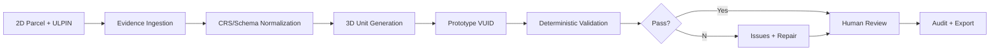

# Master Build Specification

## Goal
Build a machine-assisted 3D cadastral prototype that converts a 2D parcel into structured 3D spatial units, validates their spatial relationships, and preserves linkage to the parent ULPIN and evidence.

## Workflow

## MVP
1. Import parcel GeoJSON + parent ULPIN.
2. Import building footprint/floor metadata.
3. Extrude/split into floor and basement volumes.
4. Generate deterministic prototype VUIDs.
5. Attach evidence IDs/checksums.
6. Validate geometry, vertical intervals, containment, overlaps, identity and provenance.
7. 3D viewer with parcel/unit tree, clipping, selection and issue highlighting.
8. Human approve/reject workflow.
9. Provenance-rich JSON export.

## Non-goals
Legal title adjudication, replacing ULPIN, nationwide deployment, autonomous cadastral surveying, fake ML accuracy claims, blockchain, LLM geometry decisions.

## Done when
A seeded demo loads, generates 3D units, detects a deliberately overlapping floor, allows correction, records approval/audit, and exports the traceable result.
