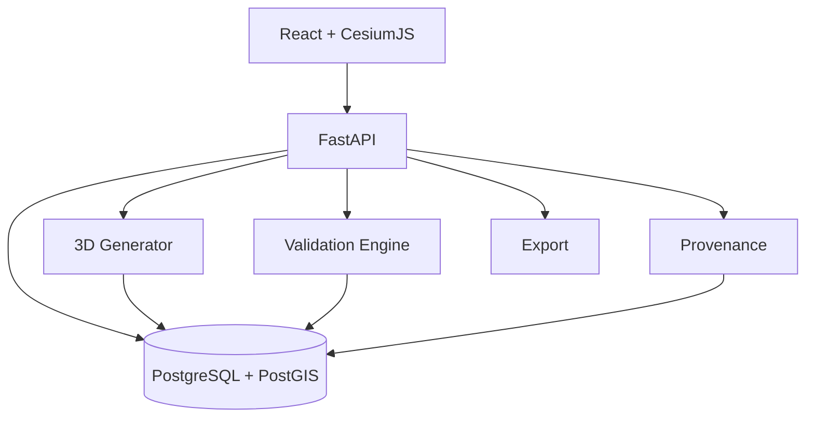

# Architecture

Frontend visualizes; it does not make authoritative geometry decisions.
API validates requests and orchestrates.
Generator performs deterministic extrusion/floor construction.
Validator produces stable rule-coded issues.
PostGIS stores spatial objects and relationships.
Export produces machine-readable audit/provenance packages.

Failure rule: validation failure or service failure must never silently become "valid".
