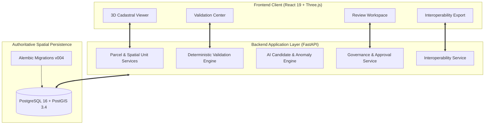
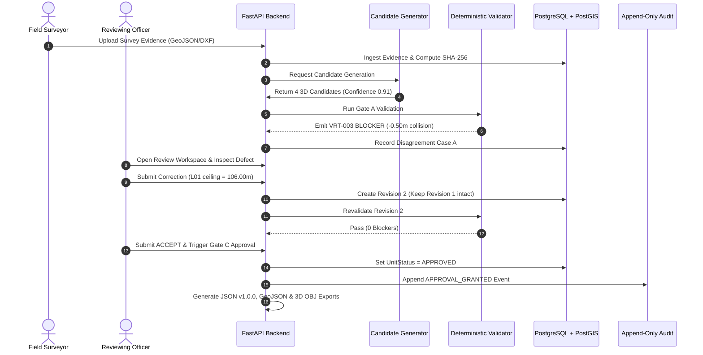

# BhuVistaar

## 3D Cadastral Intelligence & Validation Platform

*Machine-assisted 3D Cadastral Extension & Validation Layer for SIH26011*  
**Built and Maintained by Team VoidBreakers**

---

> [!IMPORTANT]
> **PROTOTYPE STATUS & LEGAL DISCLAIMER**  
> BhuVistaar is an engineering research prototype developed for Smart India Hackathon (SIH 2026) under Problem Statement `SIH26011` (Ministry of Rural Development / Department of Land Resources).  
> - BhuVistaar is **NOT** an official Government of India land administration system.
> - BhuVistaar does **NOT** alter, mutate, or replace the official 14-digit ULPIN (Bhu-Aadhaar).
> - Prototype Volumetric Unique Identifiers (**VUID**) are prototype data-layer keys and are **NOT** official 3D ULPINs.
> - The platform performs deterministic geometric and vertical validation; it does **NOT** adjudicate legal land titles or ownership rights.
> - All officer authorization headers operate strictly in `SIMULATED_PROTOTYPE` mode.
> - Demonstration fixtures are labeled `SYNTHETIC PROTOTYPE DATA`.

---

## 1. Problem
Conventional land records bind property rights to a flat 2D parcel polygon identified by a 14-digit **ULPIN**. However, vertical property strata—such as multi-storey residential apartments, commercial complexes, subterranean transit shafts, basements, and elevated utility easements—occupy the same ground footprint.

A 2D GIS representation collapses these distinct legal spaces into a single planar surface, causing:
1. **Vertical Boundary Ambiguity:** Multiple owners stacked above the same ground parcel cannot be disambiguated in 2D space.
2. **Undetected Spatial Clashes:** Multi-owner floor collisions and air-rights infringements remain invisible to 2D topological validators.
3. **Detached CAD Models:** Building models exist in disconnected drawings, severed from the statutory ground cadastre.

---

## 2. Solution
BhuVistaar introduces an authoritative, machine-assisted 3D cadastral intelligence and validation layer that bridges statutory 2D ground parcels with volumetric spatial units.

The operational workflow follows an unbroken chain of custody:
$$\text{2D Ground Parcel} \rightarrow \text{Evidence Ingestion} \rightarrow \text{Quality Gate} \rightarrow \text{AI Candidate Proposal} \rightarrow \text{Deterministic Validation} \rightarrow \text{Human Review} \rightarrow \text{Non-Destructive Revision} \rightarrow \text{Gate C Approval} \rightarrow \text{Append-Only Audit} \rightarrow \text{Interoperable Export}$$

---

## 3. Core Differentiator
BhuVistaar's core differentiator is not merely that it combines GIS, 3D WebGL, and machine learning.

**The core differentiator is the governed trust chain:**
$$\text{AI IS NOT THE AUTHORITY.}$$
1. **Advisory Machine Layer:** Machine learning models propose candidates and flag anomalies; they have zero authority to alter records or bypass rules.
2. **Deterministic Mathematical Gates:** Independent spatial algorithms detect physical collisions (e.g. VRT-003 overlap) without auto-clipping.
3. **Mandatory Human Governance:** An officer must review evidence triads, execute non-destructive corrections, and sign off before Gate C permits approval.
4. **Historical Immutability:** Corrections spawn Revision 2 while preserving defective Revision 1 intact for legal auditing.

---

## 4. System Architecture



---

## 5. End-to-End Flow



---

## 6. Features by Product Role

| Product Role | Key Capabilities |
|---|---|
| **Spatial Foundation** | 14-digit parent ULPIN locking, SRID 32643 metric coordinate space, representation-invariant deterministic VUID generation. |
| **Evidence & Provenance** | Pre-flight quality gating (`ACCEPTED`, `WARNING`, `BLOCKED`), SHA-256 duplicate detection, cross-source elevation conflict detection. |
| **AI Cadastral Intelligence** | Prismatic extrusion candidate model, cadastral anomaly detector, AI vs Validation Disagreement Engine (Cases A, B, C, D). |
| **Deterministic Validation** | Gate A (`GEO`, `TOP`, `VRT`), fact-grounded explainability breakdown (-0.50m gap vs -0.001m tolerance), immovable blocker guards. |
| **Human Review & Governance** | Attention queue prioritization, side-by-side evidence triad viewer, non-destructive correction, Gate C adjudication. |
| **Lineage & Audit** | Immutable DAG revision history, append-only audit event trail with correlation IDs, cryptographic reproducibility snapshots. |
| **Deployment & Ops** | Multi-container Docker Compose, tri-level health probes (`/health/ready`), 11 field simulation scenarios, backup/restore procedures. |
| **Interoperability** | BhuVistaar JSON v1.0.0, 2D GeoJSON RFC 7946, 3D Wavefront OBJ mesh, automated round-trip verification. |

---

## 7. Slice Implementation Status

| Slice | Module Name | Scope & Capabilities | Verification Status |
|---|---|---|---|
| **Slice 1A** | Spatial Core & Gate A | PostGIS persistence, EPSG:32643, deterministic VUID, Gate A spatial rules. | **VERIFIED** (17 tests passing) |
| **Slice 1B** | Governance & Provenance | Human review, non-destructive corrections, Gate C, append-only audit. | **VERIFIED** (20 tests passing) |
| **Slice 2** | 3D Cadastral Workspace | Three.js viewer, conflict highlight box, unit inspector, revision diff. | **VERIFIED** (Workspace E2E passing) |
| **Slice 3** | AI Cadastral Intelligence | Multi-model candidate proposals, anomaly detection, reviewer attention queue. | **VERIFIED** (14 tests passing) |
| **Slice 4** | Validation Intelligence | Disagreement Cases A-D, fact-grounded explainability, reproducibility snapshots. | **VERIFIED** (11 tests passing) |
| **Slice 5** | Deployment & Interoperability | Docker Compose, tri-level health, 11 field simulations, JSON/GeoJSON/OBJ export. | **VERIFIED** (15 tests passing + E2E) |
| **Slice 6** | Release Candidate Hardening | Negative governance tests, Judge Demo Mode, complete documentation, release manifest. | **RELEASE CANDIDATE** (79/79 passing) |

---

## 8. Tech Stack

- **Authoritative Database:** PostgreSQL 16 with PostGIS 3.4 spatial extension.
- **Backend API:** Python 3.12, FastAPI, SQLAlchemy 2.0 ORM, GeoAlchemy2, Pydantic v2.
- **Spatial Geometry:** Shapely 2.0, PyProj (metric projections), WKB serialization.
- **Frontend Client:** React 19, TypeScript, Vite v8.3.1, Three.js WebGL visualizer, Lucide icons.
- **Containerization:** Docker Compose, multi-stage Node/Nginx frontend container.
- **Testing & E2E:** Pytest, Hypothesis property testing, Playwright headless browser E2E.

---

## 9. Quick Start

### Prerequisites
- Python 3.12+
- Node.js 20+
- Docker & Docker Compose (or local PostgreSQL 16 + PostGIS 3.4)

### Clone & Setup
```bash
git clone https://github.com/abdul05kh/bhuvistaar-3d-cadastre.git
cd bhuvistaar-3d-cadastre

# Backend setup
py -3.12 -m venv .venv
source .venv/bin/activate  # On Windows: .venv\Scripts\activate
pip install -r requirements.txt

# Frontend setup
cd frontend
npm install
cd ..
```

### Environment Configuration
```bash
cp .env.example .env
```

### Database Initialization & Migrations
```bash
# Start PostGIS container
docker compose up -d db

# Run Alembic migrations to head
alembic upgrade head

# Bootstrap demo fixtures
py -3.12 -c "from backend.db.session import SessionLocal; from backend.db.bootstrap import bootstrap_database; db = SessionLocal(); bootstrap_database(db, reset=True)"
```

### Running Backend & Frontend
```bash
# Terminal 1: Backend
py -3.12 -m uvicorn backend.main:app --host 0.0.0.0 --port 8000 --reload

# Terminal 2: Frontend
cd frontend
npm run dev
```
Open your browser at `http://localhost:5173`.

---

## 10. Docker Deployment

Deploy the entire stack in one command:
```bash
docker compose up -d --build
```
- Frontend: `http://localhost:5173`
- Backend API: `http://localhost:8000`
- Swagger Docs: `http://localhost:8000/docs`
- Health Probe: `http://localhost:8000/health/ready`

---

## 11. Judge Demonstration

The interface provides an integrated **Judge Demo Mode**:
1. Click **30s Tour** for an executive visual breakdown.
2. Click **Why? FAQ** for concise answers to core technical questions.
3. Turn on **Presenter Cue** to follow the 10-step Golden Walkthrough:
   - Step 1: Parent parcel ULPIN root
   - Step 2: Evidence ingestion & SHA-256 hashing
   - Step 3: AI candidate proposal (non-authoritative)
   - Step 4: 3D extruded prisms & prototype VUID
   - Step 5: Deterministic validation (VRT-003 overlap blocker)
   - Step 6: Fact-grounded explainability & Disagreement Case A
   - Step 7: Human officer correction $\to$ Revision 2
   - Step 8: Revalidation (0 blockers) & new VUID
   - Step 9: Officer ACCEPT & Gate C adjudication
   - Step 10: Append-only audit trail & interoperable export
4. Click **Reset Demo** at any point to restore the deterministic baseline state.

---

## 12. Deterministic Validation Engine

Validation is segregated into distinct gates:
- **Gate A (Cadastral Spatial Rules):**
  - `GEO-001..004`: Coordinate bounds, polygon closure, non-self-intersection, positive height ($z_{\text{max}} > z_{\text{min}}$).
  - `TOP-001`: Ground footprint containment within parent parcel boundary (`ST_Contains`).
  - `VRT-003`: Vertical stratification non-overlap: $z_{\text{max}}(U_1) \le z_{\text{min}}(U_2) + \epsilon$ ($\epsilon = -0.001\text{m}$).
- **Gate B (Provenance Integrity):**
  - `PROV-001..004`: Verifies that underlying evidence records exist, match SHA-256 hashes, and are cryptographically linked.
- **Gate C (Statutory Adjudication):**
  - Strictly blocks approval if blocker count $> 0$, if validation is stale (`VALIDATION_OUTDATED`), if evidence checksums mismatch (`STALE_EVIDENCE`), or if no human ACCEPT review is recorded.

---

## 13. Machine Intelligence & AI Disclosure

> [!WARNING]
> Machine intelligence models are strictly non-authoritative. They propose candidates and flag anomalies. They cannot grant statutory approvals or alter legal boundaries.

- **Prismatic Candidate Model (`prismatic-candidate-001`):** Synthesizes initial floor levels from 2D footprints with confidence scores and reason codes.
- **Cadastral Anomaly Detector (`cadastral-anomaly-001`):** Flags potential inter-floor collisions before formal validation.
- **Disagreement Engine:** Explicitly classifies tensions between AI confidence and spatial validation (Cases A, B, C, D).
- **Synthetic Evaluation Disclosure:** Benchmark scores are evaluated across 10 controlled synthetic scenarios labeled `SYNTHETIC_PROTOTYPE_EVALUATION`.

---

## 14. Cryptographic Reproducibility

BhuVistaar pins every operational result to a cryptographic reproducibility snapshot:
- Source evidence SHA-256 digests
- Canonical WKB geometry hex
- Internal storage CRS (`EPSG:32643`)
- Model configuration hashes
- Validation ruleset version (`v1.0.0`)
- Software commit hash

Re-running the workflow against identical inputs produces mathematically identical VUIDs and validation outcomes.

---

## 15. Interoperability & Open Formats

Exports are generated via `backend/services/interoperability_service.py`:
1. **BhuVistaar JSON v1.0.0:** Complete semantic package with provenance, revisions, and audit events.
2. **2D GeoJSON (RFC 7946):** Projected coordinates with vertical property attributes (`z_min`, `z_max`, `floor_number`).
3. **3D Wavefront OBJ:** Volumetric boundary mesh for CAD and 3D modeling tools.
4. **Round-Trip Verification:** `POST /api/v1/export/roundtrip/verify` re-imports exports and validates geometry and VUID match (`status: MATCH`).

---

## 16. Field Simulation Engine

Demonstrates platform resilience under 11 controlled operational conditions:
1. `defect`: Flagship VRT-003 overlap collision.
2. `clean`: Flawless 4-floor baseline.
3. `out_of_parcel`: TOP-001 boundary encroachment.
4. `conflicting_evidence`: Survey vs CAD elevation discrepancy.
5. `missing_evidence`: Missing architectural floorplan.
6. `ai_unavailable`: Complete offline fallback to deterministic pipeline.
7. `stale_evidence`: Ingesting updated evidence invalidates old candidates.
8. `stale_validation`: Mutating geometry marks validation outdated.
9. `review_rejection`: Reviewing officer rejects ambiguous proposal.
10. `golden_workflow`: Complete 22-step operational lifecycle.
11. `failure_recovery`: Interrupted upload resume with zero duplicate creation.

---

## 17. Security Baseline

- **Zero Hardcoded Secrets:** All credentials loaded via environment variables (`.env`).
- **Strict Role Boundaries:** Enforces `VIEWER`, `REVIEWER`, `APPROVER`, `ADMIN`, `FIELD_OPERATOR` in prototype simulation.
- **Upload Controls:** Maximum upload size enforced (50MB) with MIME and file extension validation.
- **Path Traversal Defense:** Sanitized basenames and UUID storage paths.
- **SQL Injection Defense:** All queries parameterized via SQLAlchemy and GeoAlchemy2.
- **Status:** Evaluated under prototype threat modeling; not formally penetration tested.

---

## 18. Testing & Verification

- **Total Backend Pytest Suite:** **79 / 79 passed (100% green)** in `47.58s`.
- **Playwright Browser E2E:** **PASSED** in real browser (Edge/Chromium) in `15.71s`.
- **Frontend Production Build:** `npm run build` succeeds in `728ms`.
- **Database Integrity Audit:** `verify_data_integrity()` reports zero orphan units, zero broken links (`PASS`).

```bash
# Execute Pytest Suite
py -3.12 -m pytest tests/ -v

# Execute Browser E2E Test
py -3.12 -m pytest tests/e2e/test_slice5_browser_e2e.py -v -s
```

---

## 19. Feasibility & Maturity Boundary

- **Prototype (Today):** Fully functional, verified spatial engine, deterministic validation, non-destructive revisioning, human review, and export.
- **MVP (State Pilot):** Multi-zone projected CRS pipelines, OIDC/Keycloak authentication, and persistent IndexedDB offline field storage.
- **Production:** Statutory 3D ULPIN legislation, PKI Class 3 digital signatures (DSC/eSign), and direct integration with state land record portals.

---

## 20. Known Limitations

1. **Extruded Prismatic Geometries Only:** Non-horizontal curved meshes (domes, spiral ramps) are not validated by the extrusion engine.
2. **Single Calibrated Projected Domain:** Calibrated for Bangalore in `EPSG:32643`; state-specific datum shift grid tables are not bundled.
3. **Simulated Role Authentication:** Administrative roles operate via client headers under `SIMULATED_PROTOTYPE` mode.
4. **No Auto-Clipping:** Defective geometries are blocked rather than silently modified.

---

## 21. Roadmap

- **Post-Hackathon MVP:**
  - OIDC/Keycloak integration with JWT signatures.
  - Multi-zone coordinate pipelines across all Indian UTM zones.
  - OGC CityGML v2.0 LOD2 and LandXML 1.2 export serialization.
- **Production Horizons:**
  - Statutory 3D ULPIN national standard alignment.
  - Mutual-TLS API bridges with State Land Registries (Bhoomi, Dharani).
  - High-density spatial GPU indexing and distributed partitioning.

---

## 22. Project Structure

```text
bhuvistaar-3d-cadastre/
├── backend/
│   ├── ai/               # Candidate generation, anomaly detection, disagreement engine
│   ├── api/v1/           # REST endpoints (parcels, units, validation, governance, export, demo)
│   ├── db/               # PostgreSQL + PostGIS session and bootstrap utilities
│   ├── domain/           # Core cadastral entities, enums, and data contracts
│   ├── geometry/         # CRS validation, polygon normalization, volumetric extrusion
│   ├── repository/       # SQLAlchemy database repositories
│   ├── schemas/          # Strict Pydantic v2 contract schemas
│   ├── services/         # Application business logic (validation, approval, correction, export)
│   └── vuid/             # Representation-invariant deterministic VUID generator
├── frontend/
│   ├── src/
│   │   ├── api/          # Axios REST client with correlation ID handling
│   │   ├── components/   # Modular React components (3D viewer, review, validation, inspector)
│   │   └── types/        # TypeScript interfaces matching backend contracts
├── docs/                 # Complete 18-document architectural & operational specification suite
├── tests/
│   ├── e2e/              # Playwright real-browser interactive tests
│   ├── integration/      # Live PostGIS database integration tests
│   └── unit/             # Spatial, VUID, and negative governance unit tests
├── docker-compose.yml    # Multi-container orchestration (DB, API, Frontend)
├── Dockerfile.frontend   # Production Nginx SPA build
├── pyproject.toml        # Python packaging and dependency declarations
└── release-manifest.json # Formal release candidate metadata
```

---

## 23. Complete Documentation Package

- [Master Architecture](file:///d:/projects/BhuVistaar/docs/final-architecture.md)
- [End-to-End Operational Flow](file:///d:/projects/BhuVistaar/docs/end-to-end-flow.md)
- [Feature Catalog](file:///d:/projects/BhuVistaar/docs/feature-catalog.md)
- [User Workflows](file:///d:/projects/BhuVistaar/docs/user-workflows.md)
- [Feasibility Matrix](file:///d:/projects/BhuVistaar/docs/feasibility.md)
- [Prototype vs MVP vs Production](file:///d:/projects/BhuVistaar/docs/prototype-vs-mvp.md)
- [Public Claims & Evidence Register](file:///d:/projects/BhuVistaar/docs/claims-and-evidence.md)
- [Architecture Traceability](file:///d:/projects/BhuVistaar/docs/traceability.md)
- [Problem $\to$ Solution Traceability](file:///d:/projects/BhuVistaar/docs/problem-solution-traceability.md)
- [Machine Intelligence & AI Disclosure](file:///d:/projects/BhuVistaar/docs/ai-disclosure.md)
- [Known Limitations & Unsupported Capabilities](file:///d:/projects/BhuVistaar/docs/limitations.md)
- [Model Evaluation & Benchmark Report](file:///d:/projects/BhuVistaar/docs/evaluation.md)
- [Judge Demonstration Guide](file:///d:/projects/BhuVistaar/docs/demo-guide.md)
- [3-Minute Timed Presentation Script](file:///d:/projects/BhuVistaar/docs/demo-script.md)
- [Judge Technical FAQ](file:///d:/projects/BhuVistaar/docs/judge-faq.md)
- [Operational Failure Matrix](file:///d:/projects/BhuVistaar/docs/failure-matrix.md)
- [Capability Status Matrix](file:///d:/projects/BhuVistaar/docs/capability-status.md)
- [Final Test Matrix](file:///d:/projects/BhuVistaar/docs/final-test-matrix.md)
- [Deployment Guide](file:///d:/projects/BhuVistaar/docs/deployment.md)
- [Interoperability Specification](file:///d:/projects/BhuVistaar/docs/interoperability.md)
- [Security Baseline](file:///d:/projects/BhuVistaar/docs/security.md)
- [Field Simulation Architecture](file:///d:/projects/BhuVistaar/docs/field-simulation.md)

---

## 24. Core Team & Attribution

**Team VoidBreakers** — Smart India Hackathon (SIH 2026), Problem Statement `SIH26011`:
- **Mohammad Abdul Kalam Hussain** ([@abdul05kh](https://github.com/abdul05kh)) — *Team Lead / ML Engineer*
- **Siri Chandana** ([@kotagirisirichandana](https://github.com/kotagirisirichandana)) — *Remote Sensing / GIS Specialist*
- **Mohammad Zakiruddin** ([@zakirverse](https://github.com/zakirverse)) — *Frontend Developer*
- **Mohammed Numan** ([@mohammednumaan716](https://github.com/mohammednumaan716)) — *AI Engineer*
- **Manivarun Chintala** ([@manivarun-05](https://github.com/manivarun-05)) — *Data Infrastructure / Backend Developer*
- **Thaniska** ([@thanishkaX](https://github.com/thanishkaX)) — *QA & Verification Lead*

*Full attribution protocol detailed in [`CONTRIBUTORS.md`](file:///d:/projects/BhuVistaar/CONTRIBUTORS.md).*

---

## 25. Statutory Disclaimer

```
Prototype VUID — not an official 3D ULPIN.
All demo parcels, units, and evidence files represent SYNTHETIC PROTOTYPE DATA.
BhuVistaar verifies geometric and vertical spatial consistency;
it does NOT determine land ownership, adjudicate legal titles,
or replace statutory survey authorities.
```
