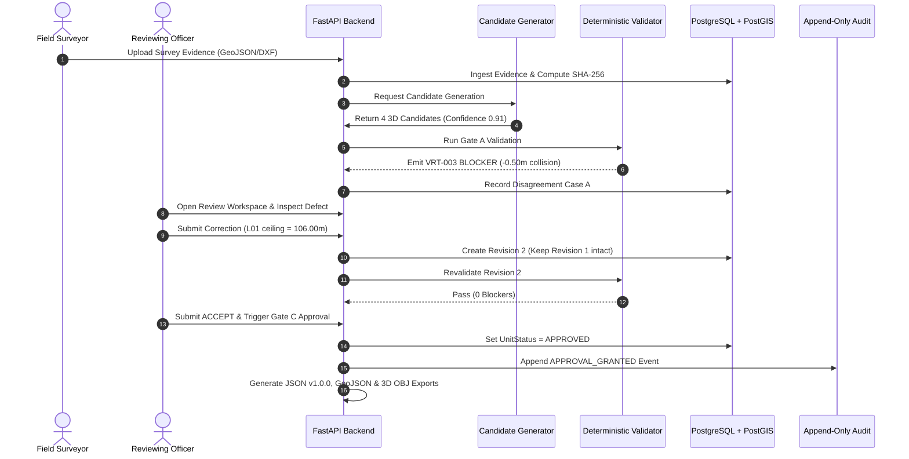

# BhuVistaar — End-to-End Operational Flow

This document details the complete 22-step operational lifecycle of a 3D cadastral property through BhuVistaar.

---

## The 22-Step Golden Property Lifecycle

| Step | Phase | Subsystem | Action & Description | Verification / Artifact |
|---|---|---|---|---|
| **1** | Startup | Infrastructure | System boot; PostgreSQL 16 + PostGIS 3.4 connectivity confirmed. | `/health/ready` returns `status: "ready"` |
| **2** | Parcel Intake | Spatial Core | Load synthetic 2D ground parcel (ULPIN: `12345678901234`, 40m x 30m) in `EPSG:32643`. | `parent_parcels` row inserted |
| **3** | Evidence Ingestion | Ingestion | Intake Total Station Survey GeoJSON and Architectural Elevation plan. | SHA-256 computed on ingest |
| **4** | Quality Gate | Pre-Validation | Pre-flight quality check: CRS match, valid polygon rings, schema adherence. | `EvidenceQuality.ACCEPTED` |
| **5** | Observation | AI / Analytics | Extract raw physical observations: floor heights, building footprint, survey boundaries. | Observations logged in database |
| **6** | Candidate Gen | Machine Proposal | Prismatic model synthesizes 4 floor levels (B01, G00, L01, L02) with confidence scores. | `ai_candidates` status: `PROPOSED` |
| **7** | Provenance Link | Governance | Candidates cryptographically bound to raw evidence checksums. | `provenance_records` created |
| **8** | VUID Generation | Spatial Core | Deterministic representation-invariant VUID computed from canonical WKB. | Format: `VUID-IND-KA-BLR-2026-0001-FL01` |
| **9** | Gate A Validation | Validation | Run deterministic rules: GEO (validity), TOP (parent containment), VRT (vertical non-overlap). | `validation_runs` recorded |
| **10** | Defect Trigger | Field Sim | Level L01 ceiling (106.50m) collides with Level L02 floor (106.00m) by 0.50m. | Rule `VRT-003` emits `BLOCKER` |
| **11** | Explainability | Validation Intel | System computes exact gap: `observed_gap = -0.50m`, `allowed = -0.001m`. No hallucination. | Fact-grounded explanation recorded |
| **12** | Disagreement | Validation Intel | Disagreement Engine classifies as Case A (`AI_VALIDATION_DISAGREEMENT`). | `disagreement_records` created |
| **13** | Attention Queue | Reviewer Workspace | Defect candidate prioritized to top of reviewer attention queue. | Queue item status: `ATTENTION_REQUIRED` |
| **14** | Human Inspection | Reviewer Workspace | Human officer inspects side-by-side evidence triad (survey vs CAD vs candidate). | Officer identifies elevation error |
| **15** | Correction Request | Governance | Officer initiates non-destructive correction; requests L01 ceiling adjustment to 106.00m. | `review_records` status: `REQUEST_CORRECTION` |
| **16** | Revision Spawn | Governance | System creates Revision 2 (`predecessor_revision_id` $\to$ Rev 1). Rev 1 preserved intact. | `spatial_unit_revisions` Rev 2 created |
| **17** | VUID Recomp | Spatial Core | System re-canonicalizes geometry; derives new deterministic Prototype VUID. | New full SHA-256 digest pinned |
| **18** | Revalidation | Validation | Re-runs Gate A/B on Revision 2; vertical gap is now 0.00m (0 blockers). | `blocker_count: 0`, `can_approve: true` |
| **19** | Officer Sign-Off | Governance | Officer submits final review decision: `ACCEPT`. | Review status: `ACCEPT` |
| **20** | Gate C Approval | Governance | Approving officer triggers Gate C adjudication. Preconditions verified; status set to `APPROVED`. | `approval_decisions` row saved |
| **21** | Reproducibility | Reproducibility | Cryptographic snapshot generated pinning evidence, geometry, model, ruleset v1.0.0. | Snapshot SHA-256 digest pinned |
| **22** | Interop Export | Interoperability | Output produced: BhuVistaar JSON v1.0.0, 2D GeoJSON, 3D Wavefront OBJ. Re-import matches. | Verification status: `MATCH` |

---

## Traceability Diagram

